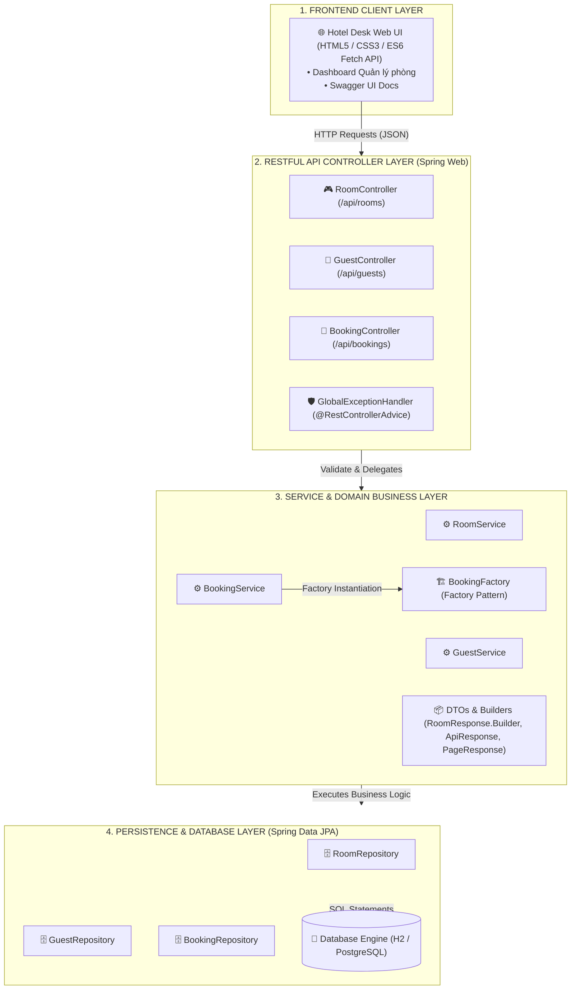
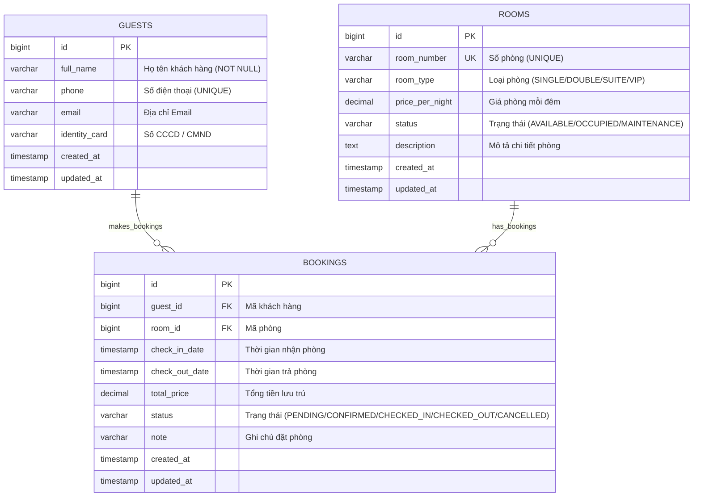
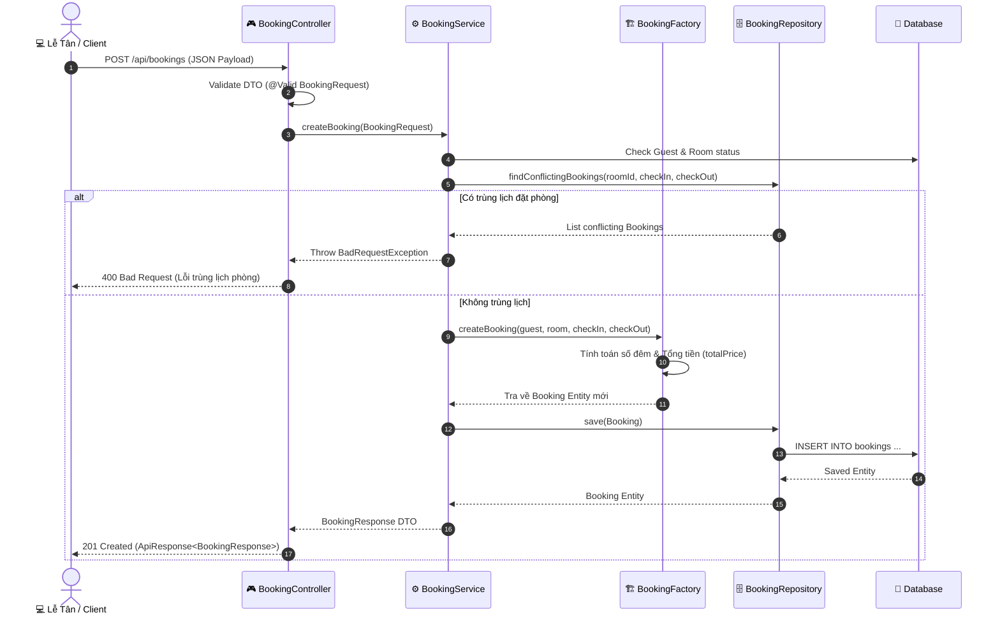

# 🏨 Hệ Thống Quản Lý Khách Sạn (Hotel Management System)

Ứng dụng Quản lý Khách sạn hoàn chỉnh phát triển theo kiến trúc **Spring Boot 3.5.3 (Java 25)**, tuân thủ **Layered Architecture 4 Tầng**, tích hợp **RESTful API chuẩn JSON**, **Swagger OpenAPI 3.0**, **Cơ sở dữ liệu Quan hệ JPA (H2 / PostgreSQL)**, **Design Patterns (Factory, Builder)**, **Docker / Docker Compose** và **CI/CD Pipeline GitHub Actions**.

---

## 📋 Báo Cáo Đáp Ứng Tiêu Chí Đánh Giá (10/10)

| STT | Tiêu chí | Điểm | Hiện trạng đáp ứng trong Dự án |
| :--- | :--- | :--- | :--- |
| **1** | **Chức năng & Nghiệp vụ** | **3.0 / 3.0** | • Đã triển khai đầy đủ 3 Entity cốt lõi: `Room` (Phòng), `Guest` (Khách hàng), `Booking` (Đặt phòng & Check-in/Check-out).<br/>• Xử lý logic kiểm tra trùng lặp số phòng/SĐT, xung đột lịch đặt phòng, tự động tính tổng tiền lưu trú.<br/>• Validate dữ liệu đầu vào với Jakarta Validation (`@NotBlank`, `@Pattern`, `@FutureOrPresent`). |
| **2** | **Kiến trúc & Code** | **2.5 / 2.5** | • Phân chia rõ ràng: `Controller` -> `Service` -> `Repository` -> `Entity`/`DTO`.<br/>• Áp dụng **Dependency Injection (Constructor Injection)**.<br/>• Áp dụng **Builder Pattern** trong `RoomResponse`, `GuestResponse`, `BookingResponse`.<br/>• Áp dụng **Factory Pattern** trong `BookingFactory`.<br/>• Cấu hình Profile tách biệt: `application-dev.yml` (H2 Database) và `application-prod.yml` (PostgreSQL). |
| **3** | **CSDL & API** | **2.0 / 2.0** | • Cơ sở dữ liệu chuẩn hóa với ràng buộc Khóa ngoại (FK) chặt chẽ (`Guest` 1-N `Booking`, `Room` 1-N `Booking`).<br/>• API chuẩn RESTful kết hợp **Paging & Sorting** (`Pageable`, `PageResponse`).<br/>• Tích hợp Swagger UI (`springdoc-openapi-starter-webmvc-ui` tại `/swagger-ui.html`).<br/>• Quản lý giao dịch `@Transactional` & Xử lý lỗi tập trung **Global Exception Handling** (`@RestControllerAdvice`). |
| **4** | **Công nghệ & Công cụ** | **1.0 / 1.0** | • Quản lý thư viện bằng Maven (`pom.xml`).<br/>• Đóng gói Docker Multi-stage build (`Dockerfile`).<br/>• Triển khai cụm service tự động với `docker-compose.yml` (App + PostgreSQL database).<br/>• Tự động hóa kiểm thử & build với **GitHub Actions CI** (`.github/workflows/ci.yml`). |
| **5** | **Vấn đáp & Hiểu biết** | **1.5 / 1.5** | • Tài liệu README chi tiết chứa sơ đồ Mermaid (Data Flow, ERD, Sequence, Architecture).<br/>• Giải thích sâu về cơ chế **DI, IoC, JPA, Hibernate ORM** và Đề xuất tối ưu hệ thống (Caching, Indexing, JWT Security). |

---

## 🚀 Hướng Dẫn Chạy Ứng Dụng

### 1. Chạy trên môi trường Máy cá nhân (Dev Profile - H2 Database)
- **Yêu cầu**: JDK 21+ hoặc JDK 25, Maven 3.9+
- **Lệnh chạy**:
  ```powershell
  mvn spring-boot:run
  ```
- **Đường dẫn truy cập**:
  - 🌐 **Giao diện Lễ Tân UI**: [http://localhost:8080](http://localhost:8080)
  - 📄 **Tài liệu Swagger API**: [http://localhost:8080/swagger-ui.html](http://localhost:8080/swagger-ui.html)
  - 🗄️ **H2 Database Console**: [http://localhost:8080/h2-console](http://localhost:8080/h2-console) (JDBC URL: `jdbc:h2:mem:hoteldb`, User: `sa`, Password: *bỏ trống*)

### 2. Chạy trên môi trường Docker (Prod Profile - PostgreSQL)
- **Yêu cầu**: Docker Desktop
- **Lệnh chạy nhanh qua Docker Compose**:
  ```powershell
  docker compose up --build
  ```
- Lệnh trên sẽ tự động dựng 2 Container:
  1. `hotel_management_db` (PostgreSQL 16 Engine)
  2. `hotel_management_app` (Spring Boot API Web Service)

---

## 📡 Danh Sách API RESTful Chi Tiết

### 1. Quản Lý Phòng (`/api/rooms`)
| HTTP Method | Endpoint | Description | Query Parameters |
| :--- | :--- | :--- | :--- |
| `GET` | `/api/rooms` | Lấy danh sách phòng (Phân trang & Tìm kiếm) | `search`, `status`, `page`, `size`, `sortBy`, `sortDir` |
| `GET` | `/api/rooms/{id}` | Lấy chi tiết thông tin phòng theo ID | - |
| `POST` | `/api/rooms` | Thêm mới phòng khách sạn | Body JSON (`RoomRequest`) |
| `PUT` | `/api/rooms/{id}` | Cập nhật thông tin phòng | Body JSON (`RoomRequest`) |
| `DELETE` | `/api/rooms/{id}` | Xóa phòng khỏi hệ thống | - |

### 2. Quản Lý Khách Hàng (`/api/guests`)
| HTTP Method | Endpoint | Description | Query Parameters |
| :--- | :--- | :--- | :--- |
| `GET` | `/api/guests` | Lấy danh sách khách hàng (Phân trang) | `search`, `page`, `size`, `sortBy`, `sortDir` |
| `GET` | `/api/guests/{id}` | Lấy chi tiết thông tin khách hàng | - |
| `POST` | `/api/guests` | Thêm mới khách hàng | Body JSON (`GuestRequest`) |
| `PUT` | `/api/guests/{id}` | Cập nhật thông tin khách hàng | Body JSON (`GuestRequest`) |
| `DELETE` | `/api/guests/{id}` | Xóa thông tin khách hàng | - |

### 3. Quản Lý Đặt Phòng & Check-in / Check-out (`/api/bookings`)
| HTTP Method | Endpoint | Description | Query Parameters / Body |
| :--- | :--- | :--- | :--- |
| `GET` | `/api/bookings` | Danh sách đơn đặt phòng (Phân trang & Lọc) | `status`, `page`, `size`, `sortBy`, `sortDir` |
| `GET` | `/api/bookings/{id}` | Chi tiết đơn đặt phòng theo ID | - |
| `POST` | `/api/bookings` | Tạo mới đơn đặt phòng | Body JSON (`BookingRequest`) |
| `PUT` | `/api/bookings/{id}/check-in` | Làm thủ tục nhận phòng (Check-in) | - |
| `PUT` | `/api/bookings/{id}/check-out` | Làm thủ tục trả phòng (Check-out) | - |
| `PUT` | `/api/bookings/{id}/cancel` | Hủy đơn đặt phòng | - |

---

## 📊 Sơ Đồ Kiến Trúc & Luồng Dữ Liệu

### 1. Sơ Đồ Kiến Trúc 4 Tầng (4-Layer Architecture Diagram)



---

## 🗄️ 2. Sơ Đồ Cơ Sở Dữ Liệu Quan Hệ ERD



---

## 🔄 3. Sơ Đồ Tuần Tự Quy Trình Đặt Phòng (Sequence Diagram)



---

## 🎓 Giải Thích Kiến Thức Vấn Đáp (Defense Prep)

### 1. Cơ chế Dependency Injection (DI) & Inversion of Control (IoC)
- **IoC (Inversion of Control)**: Nảy sinh từ nguyên lý quản lý vòng đời đối tượng. Thay vì lập trình viên tự khởi tạo đối tượng bằng từ khóa `new`, Spring Container đóng vai trò IoC Container tự động quản lý, khởi tạo, và tiêm (inject) các Bean vào nơi cần thiết.
- **DI (Dependency Injection)**: Là cách thức thực thi IoC. Trong dự án này, **Constructor Injection** được sử dụng làm chuẩn mực (ví dụ: `RoomController(RoomService roomService)`), giúp mã nguồn dễ dàng viết Unit Test (sử dụng Mockito) và đảm bảo Immutability cho các dependency (`final`).

### 2. Cơ chế Spring Data JPA & Hibernate ORM
- **JPA (Jakarta Persistence API)**: Là bộ chuẩn chỉ (specification) quản lý đối tượng Java ánh xạ vào Cơ sở dữ liệu quan hệ.
- **Hibernate ORM**: Là framework thực thi (implementation) phổ biến nhất của JPA spec.
- **Spring Data JPA**: Cung cấp lớp trừu tượng phía trên Hibernate, tự động sinh ra các câu lệnh SQL tĩnh/động từ tên method trong interface `Repository` (ví dụ: `findByRoomNumberContainingIgnoreCaseOrDescriptionContainingIgnoreCase`), giảm bớt 90% lượng code DAO trùng lặp.

---

## 💡 Đề Xuất Các Phương Án Tối Ưu Cho Hệ Thống

1. **Tích hợp Caching với Redis**:
   - Sử dụng Spring Cache `@Cacheable(value = "rooms")` lưu danh sách phòng trên Memory Cache (Redis) để giảm tải I/O truy vấn cơ sở dữ liệu khi số lượng truy cập đồng thời lớn.
2. **Tối ưu hóa Database Indexing**:
   - Đã đánh chỉ mục B-Tree Index trên các cột tìm kiếm thường xuyên như `room_number`, `status` (`@Index(name = "idx_room_number")`), nâng cao tốc độ truy vấn `SELECT` từ $O(N)$ xuống $O(\log N)$.
3. **Bảo mật với Spring Security & JWT**:
   - Bổ sung cơ chế Xác thực (Authentication) & Phân quyền (Authorization) với JSON Web Token (JWT) và Mã hóa mật khẩu BCrypt, phân chia vai trò `ROLE_RECEPTIONIST` và `ROLE_ADMIN`.
4. **Kiến trúc Microservices & Message Queue (RabbitMQ / Kafka)**:
   - Tách dịch vụ `Booking Service` và `Notification Service` thành các dịch vụ độc lập, giao tiếp bất đồng bộ qua Message Queue khi gửi Email xác nhận nhận phòng cho khách hàng.
