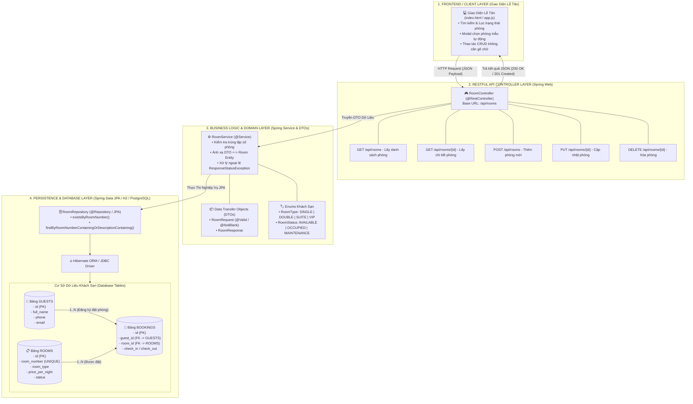
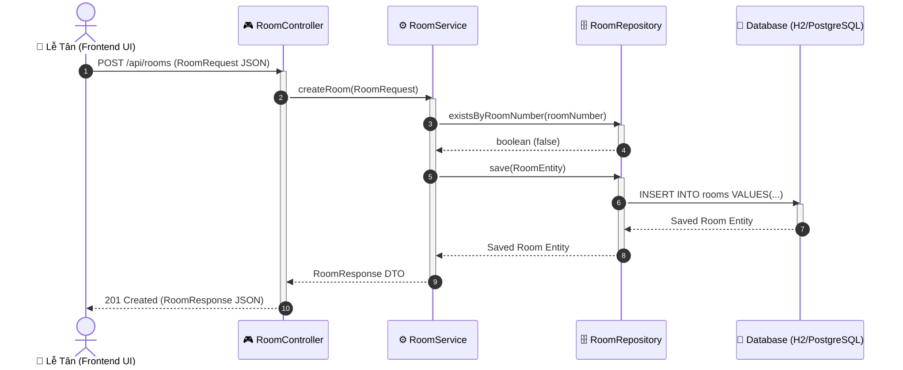

# Hệ Thống Quản Lý Khách Sạn (Hotel Management System)

Ứng dụng quản lý phòng khách sạn hoàn chỉnh được phát triển theo kiến trúc Spring Boot, tích hợp Backend RESTful API, Cơ sở dữ liệu JPA (H2 / PostgreSQL) và Giao diện người dùng Lễ tân (Hotel Desk Dark Mode UI).

---

## 🚀 Công Nghệ Sử Dụng

- **Ngôn ngữ & Framework**: Java 25 LTS, Spring Boot 3.5.3 (Spring Web, Spring Data JPA, Bean Validation).
- **Cơ sở dữ liệu**:
  - *Dev / Demo*: H2 In-Memory Database (Tự động nạp dữ liệu mẫu ban đầu).
  - *Môi trường thật*: PostgreSQL 16 (Tích hợp qua Docker Compose).
- **Giao diện người dùng (Frontend)**: HTML5, CSS3 (Glassmorphic Dark Theme), JavaScript ES6 (Fetch API).
- **Đóng gói & Công cụ**: Apache Maven 3.9+, Docker Compose.

---

## 🛠️ Hướng Dẫn Chạy Ứng Dụng

### Yêu cầu môi trường:
- JDK 25+
- Maven 3.9+

### Lệnh chạy nhanh:
```powershell
mvn spring-boot:run
```

### Đường dẫn truy cập:
- **Giao diện Web Quản lý Khách sạn**: [http://localhost:8080](http://localhost:8080)
- **H2 Database Console**: [http://localhost:8080/h2-console](http://localhost:8080/h2-console)
  - **JDBC URL**: `jdbc:h2:mem:courses`
  - **User**: `sa`
  - **Password**: *(bỏ trống)*

---

## 📡 Danh Sách RESTful API

| Phương thức | Endpoint | Mô tả |
| :--- | :--- | :--- |
| `GET` | `/api/rooms` | Lấy danh sách tất cả các phòng (Có hỗ trợ tìm kiếm `?search=...`) |
| `GET` | `/api/rooms/{id}` | Lấy thông tin chi tiết một phòng theo ID |
| `POST` | `/api/rooms` | Thêm mới thông tin phòng khách sạn |
| `PUT` | `/api/rooms/{id}` | Cập nhật thông tin phòng theo ID |
| `DELETE` | `/api/rooms/{id}` | Xóa thông tin phòng khỏi hệ thống |

---

## 📊 Sơ Đồ Kiến Trúc & Luồng Hệ Thống (Mermaid Diagrams)

### 1. Sơ Đồ Tổng Quan Kiến Trúc Hệ Thống (Master Combined Diagram)



### 2. Sơ Đồ Tuần Tự Luồng Tạo / Thêm Phòng Mới (Sequence Diagram)



