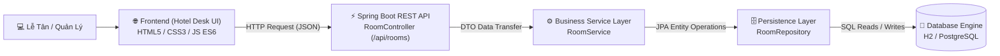
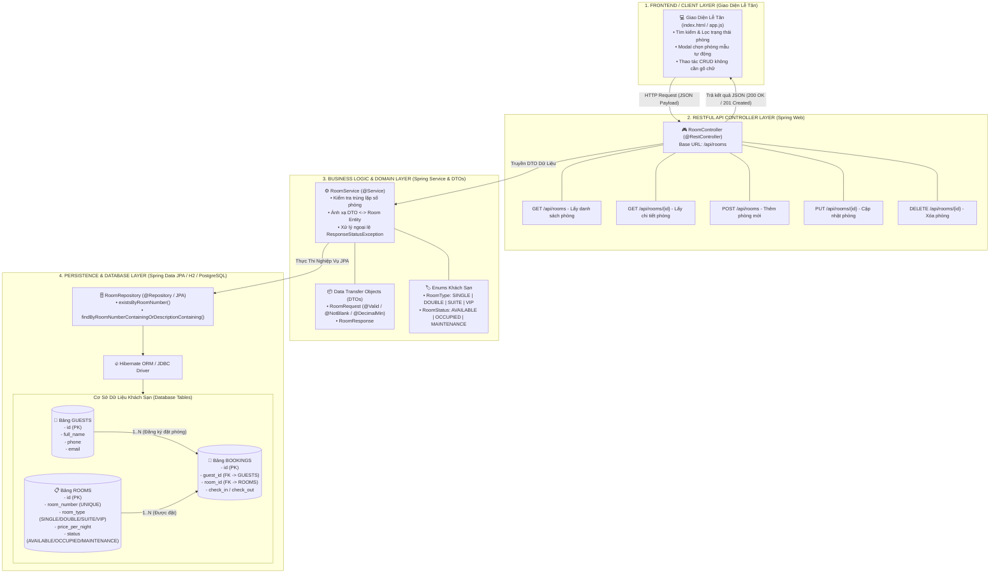
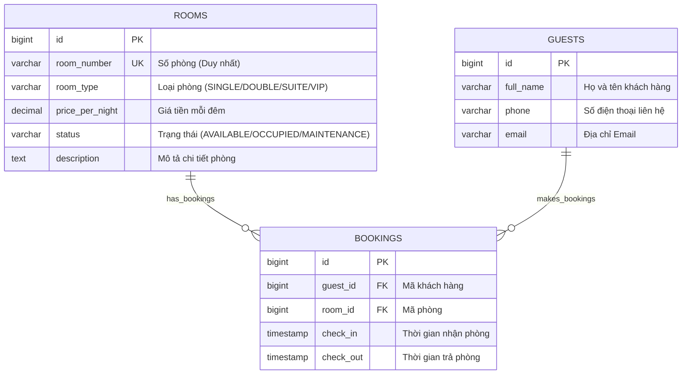
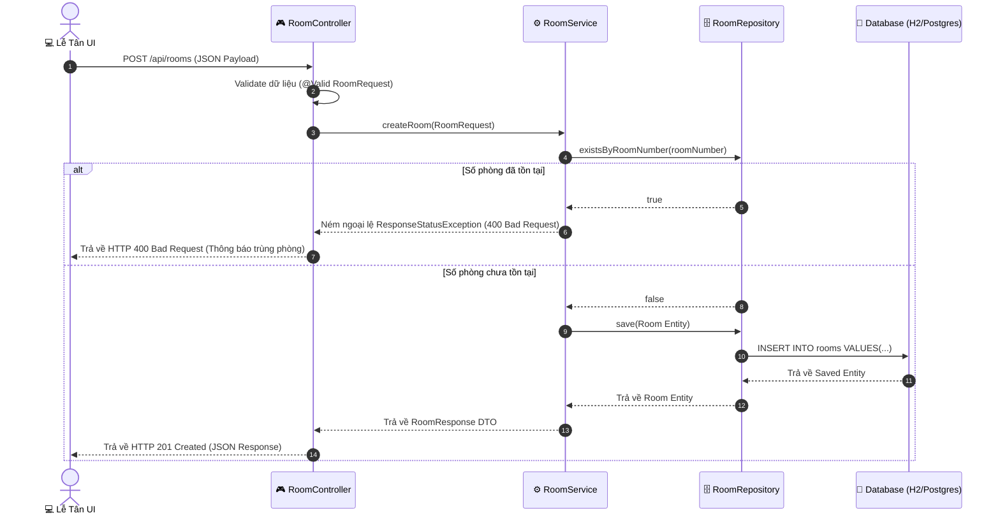

# Hệ Thống Quản Lý Khách Sạn (Hotel Management System)

Ứng dụng quản lý phòng khách sạn hoàn chỉnh được phát triển theo kiến trúc Spring Boot, tích hợp Backend RESTful API, Cơ sở dữ liệu JPA (H2 / PostgreSQL) và Giao diện người dùng Lễ tân (Hotel Desk Dark Mode UI).

---

## 🚀 Công Nghệ Sử Dụng

- **Ngôn ngữ & Framework**: Java 25 LTS, Spring Boot 3.5.3 (Spring Web, Spring Data JPA, Bean Validation).
- **Cơ sở dữ liệu**:
  - *Dev / Demo*: H2 In-Memory Database (Tự động nạp dữ liệu mẫu ban đầu).
  - *Môi trường thật*: PostgreSQL 16 (Tích hợp qua Docker Compose).
- **Giao diện người dùng (Frontend)**: HTML5, CSS3 (Glassmorphic Dark Theme), JavaScript ES6 (Fetch API).
- **Đóng gói & Công cụ**: Apache Maven 3.9+, Docker Compose.

---

## 🛠️ Hướng Dẫn Chạy Ứng Dụng

### Yêu cầu môi trường:
- JDK 25+
- Maven 3.9+

### Lệnh chạy nhanh:
```powershell
mvn spring-boot:run
```

### Đường dẫn truy cập:
- **Giao diện Web Quản lý Khách sạn**: [http://localhost:8080](http://localhost:8080)
- **H2 Database Console**: [http://localhost:8080/h2-console](http://localhost:8080/h2-console)
  - **JDBC URL**: `jdbc:h2:mem:courses`
  - **User**: `sa`
  - **Password**: *(bỏ trống)*

---

## 📡 Danh Sách RESTful API

| Phương thức | Endpoint | Mô tả |
| :--- | :--- | :--- |
| `GET` | `/api/rooms` | Lấy danh sách tất cả các phòng (Có hỗ trợ tìm kiếm `?search=...`) |
| `GET` | `/api/rooms/{id}` | Lấy thông tin chi tiết một phòng theo ID |
| `POST` | `/api/rooms` | Thêm mới thông tin phòng khách sạn |
| `PUT` | `/api/rooms/{id}` | Cập nhật thông tin phòng theo ID |
| `DELETE` | `/api/rooms/{id}` | Xóa thông tin phòng khỏi hệ thống |

---

## 📊 Mô Tả Kiến Trúc & Luồng Hệ Thống

### 1. Sơ Đồ Tổng Quan Kiến Trúc 4 Tầng (System Architecture Text Diagram)

```text
+-----------------------------------------------------------------------------------+
|                        1. FRONTEND / CLIENT LAYER (Lễ Tân UI)                     |
|  - Giao diện HTML5/CSS3 (Glassmorphic Dark Mode) + Fetch API JavaScript ES6       |
|  - Chức năng: Lọc trạng thái phòng, Modal chọn phòng mẫu, Thao tác CRUD          |
+-----------------------------------------------------------------------------------+
                                          |
                      (1) HTTP Request / Payload JSON (200 OK / 201 Created)
                                          v
+-----------------------------------------------------------------------------------+
|                     2. RESTFUL API CONTROLLER LAYER (Spring Web)                  |
|  - Class: RoomController (@RestController tại /api/rooms)                         |
|  - Endpoint: GET, POST, PUT, DELETE /api/rooms                                    |
+-----------------------------------------------------------------------------------+
                                          |
                              (2) DTO Data Transfer
                                          v
+-----------------------------------------------------------------------------------+
|                3. BUSINESS LOGIC & DOMAIN LAYER (Service & DTOs)                  |
|  - Class: RoomService (@Service)                                                  |
|  - Logic: Kiểm tra trùng số phòng, Map DTO <-> Entity, Bắt lỗi Exception          |
|  - Objects: RoomRequest (@Valid), RoomResponse, RoomType, RoomStatus              |
+-----------------------------------------------------------------------------------+
                                          |
                               (3) JPA Operations
                                          v
+-----------------------------------------------------------------------------------+
|                 4. PERSISTENCE & DATABASE LAYER (Spring Data JPA)                 |
|  - Interface: RoomRepository (existsByRoomNumber, findByRoomNumber...)            |
|  - Engine: Hibernate ORM / JDBC Driver                                            |
|  - Tables: ROOMS (PK: id, UNIQUE: room_number)                                    |
|            GUESTS (PK: id, full_name, phone, email)                               |
|            BOOKINGS (PK: id, FK: guest_id, FK: room_id)                           |
+-----------------------------------------------------------------------------------+
```

---

### 2. Sơ Đồ Kiến Trúc Luồng Tổng Quan (High-Level Architecture Diagram)



---

### 3. Sơ Đồ Chi Tiết Kiến Trúc 4 Tầng (Detailed 4-Layer Architecture Diagram)

GitHub sẽ tự động hiển thị sơ đồ trực quan dưới đây từ mã nguồn Mermaid:



---

### 🗄️ 4. Sơ Đồ Cơ Sở Dữ Liệu ERD (Entity Relationship Diagram)



---

### 🏛️ 5. Chi Tiết Các Tầng Hệ Thống (Text Breakdown)

| Tầng | Thành Phần Chính | Chức Năng & Nhiệm Vụ |
| :--- | :--- | :--- |
| **1. Client Layer** | `index.html`, `app.js`, `style.css` | Hiển thị giao diện lễ tân Dark Mode, gửi AJAX request đến Backend và làm mới UI. |
| **2. Controller Layer** | `RoomController.java` | Tiếp nhận REST API request (`/api/rooms`), validate dữ liệu đầu vào và trả về HTTP Status. |
| **3. Business Layer** | `RoomService.java`, DTOs, Enums | Thực thi logic nghiệp vụ, kiểm tra trùng lặp số phòng, chuyển đổi DTO và Entity. |
| **4. Database Layer** | `RoomRepository.java`, H2/PostgreSQL | Lưu trữ dữ liệu lâu dài vào các bảng `ROOMS`, `GUESTS`, `BOOKINGS` qua Hibernate JPA. |

---

### 🔄 6. Sơ Đồ Tuần Tự Luồng Xử Lý Khi Thêm Phòng Mới (Sequence Diagram)



#### Các Bước Thực Hiện Chi Tiết:
1. **Khởi tạo**: Lễ tân điền thông tin phòng trên giao diện web và bấm nút **"Lưu Phòng"**.
2. **Gửi Request**: JavaScript gửi yêu cầu `POST /api/rooms` kèm dữ liệu dạng JSON.
3. **Xác thực dữ liệu**: `RoomController` nhận request và kiểm tra dữ liệu đầu vào theo Annotation trong `RoomRequest`.
4. **Kiểm tra trùng lặp**: `RoomService` gọi `RoomRepository.existsByRoomNumber()` để đảm bảo số phòng chưa tồn tại trong hệ thống.
5. **Ghi CSDL**: Nếu hợp lệ, `RoomRepository` chuyển đổi sang SQL `INSERT INTO rooms ...` để lưu vào CSDL (H2/PostgreSQL).
6. **Phản hồi**: Hệ thống trả về đối tượng `RoomResponse` kèm mã HTTP `201 Created`, Frontend nhận kết quả và tự động làm mới danh sách phòng trên màn hình.


