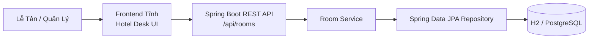

# Kiến Trúc Hệ Thống Quản Lý Khách Sạn (Hotel Management Architecture)

## Các Lớp Nghiệp Vụ

- `room/`: domain entity `Room`, enums `RoomType` & `RoomStatus`, request/response DTOs, JPA repository, service và REST controller của nghiệp vụ Quản lý Phòng Khách sạn.
- `resources/static/`: giao diện người dùng Hotel Desk được Spring Boot phục vụ trực tiếp.
- `database/schema.sql`: schema CSDL PostgreSQL/H2 gồm bảng phòng (`rooms`), khách hàng (`guests`) và đặt phòng (`bookings`).
- `application.yml`: cấu hình profile H2 mặc định và profile `postgres`.

## Bộ Sơ Đồ Mermaid Chi Tiết
Mã nguồn Mermaid đầy đủ cho Sơ đồ Kiến trúc, Sơ đồ CSDL ERD, Sơ đồ Tuần tự Sequence và Sơ đồ Lớp Class Diagram của Hệ thống Quản lý Khách sạn được tổng hợp tại [docs/diagrams.md](file:///c:/Users/Admin/Documents/GitHub/LTUD/docs/diagrams.md).
