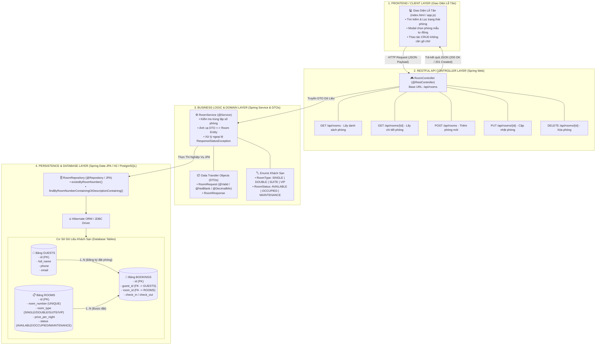

# Mã Nguồn Sơ Đồ Hợp Nhất Hệ Thống Quản Lý Khách Sạn (Single Master Mermaid Diagram)

Dưới đây là **Mã nguồn Sơ đồ Mermaid Hợp nhất Duy nhất (Single Master Diagram)** kết hợp toàn bộ 4 thành phần: Giao diện Client, Controller API, Tầng Nghiệp vụ DTO/Enum và Cơ sở dữ liệu ERD vào cùng một khối code.

---

## 🌐 Sơ Đồ Hợp Nhất Hệ Thống (Master Combined Diagram)

